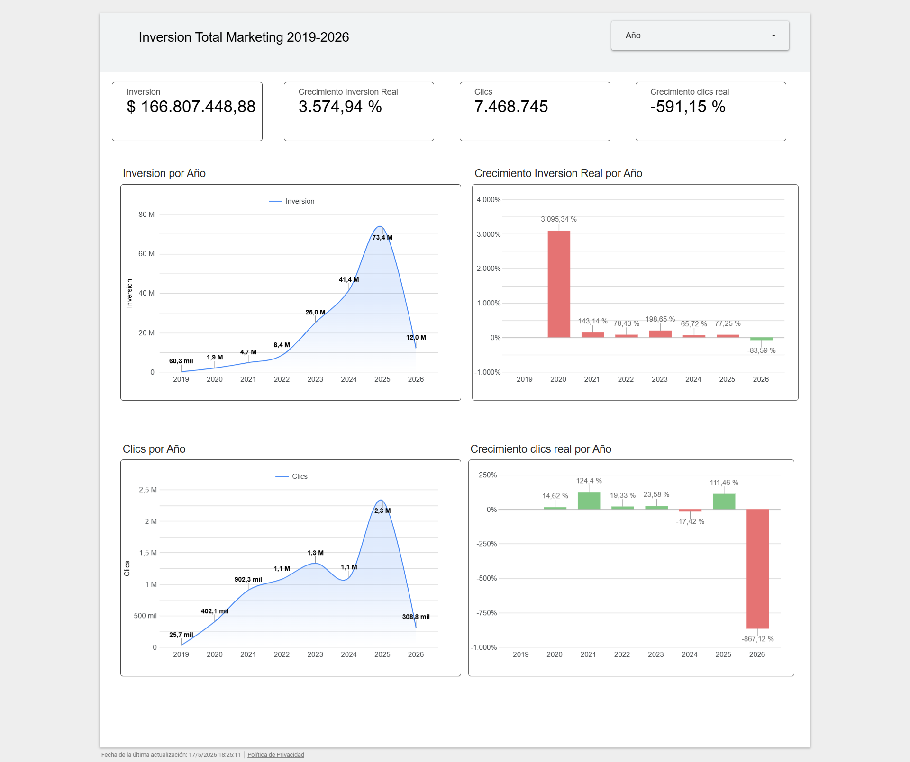
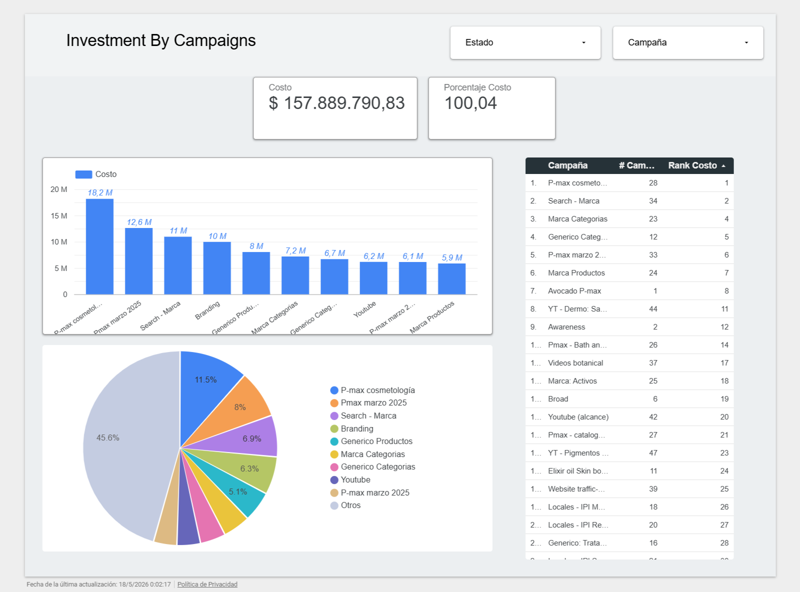
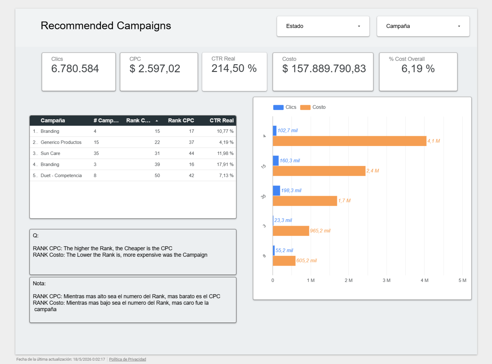
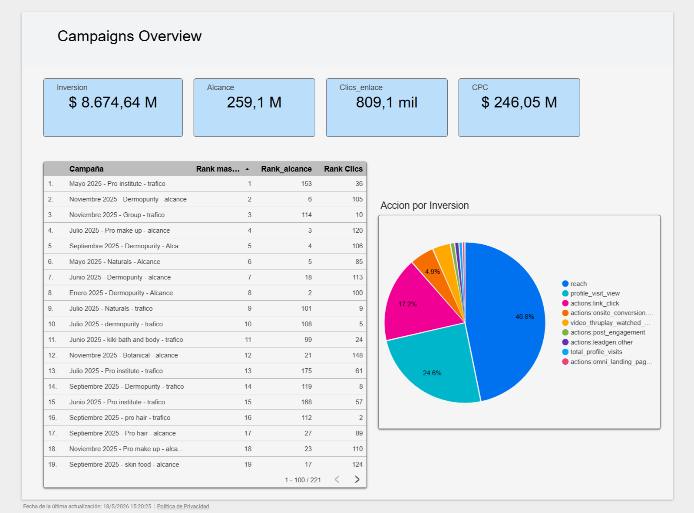
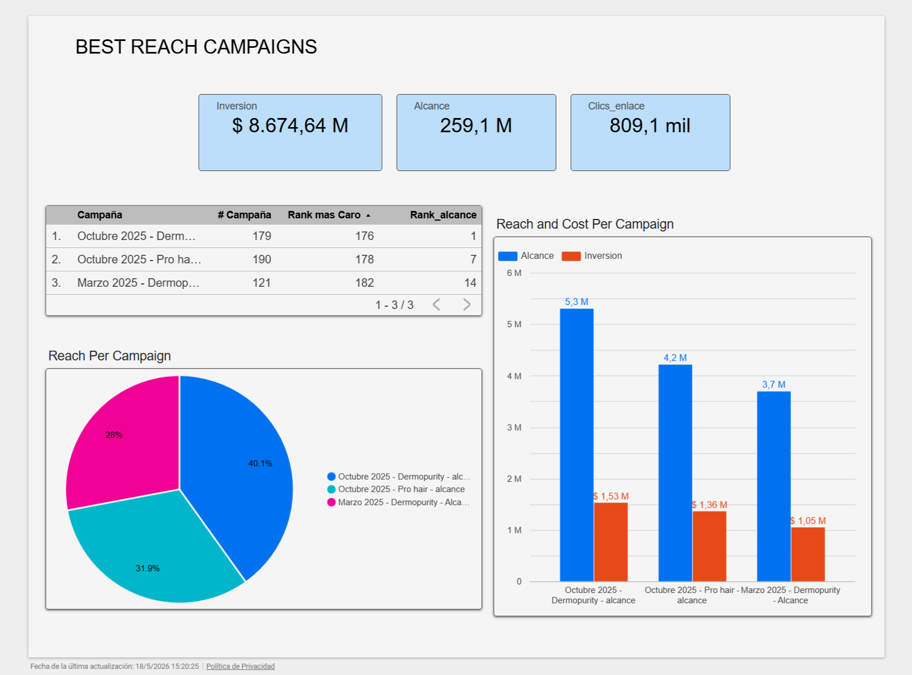
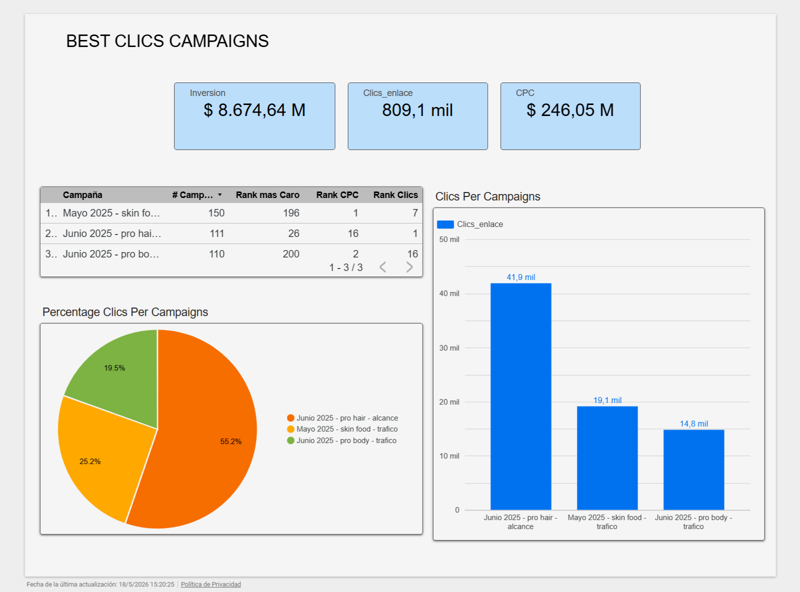

# Marketing Ads Performance Analysis

🌐 Languages: [English](README.md) | [Español](README.es.md)

---

## Business-Oriented Marketing Analytics Project

This project analyzes digital advertising performance for a beauty/cosmetics business using SQL and Looker Studio.

The goal of the analysis is to understand how marketing campaigns performed across acquisition channels, identify efficiency opportunities, and translate advertising data into business insights and recommendations.

> Note: This project is based on an anonymized dataset from a real business case. Sensitive client information, campaign identifiers, and private business data were removed or generalized.

---

## Business Context

The company invested in paid digital advertising campaigns across platforms such as Google Ads and Meta/Facebook Ads.

From a business perspective, the main challenge was not only to review campaign metrics, but to understand:

- Which campaigns generated better performance.
- Which channels were more efficient.
- Where budget allocation could be improved.
- Which metrics were useful for decision-making.
- What actions could improve future marketing performance.

This project approaches the analysis from a business and strategic perspective, not only from a technical SQL perspective.

---

## Business Questions

The analysis was guided by three main business questions:

1. Are campaigns spending efficiently over time, or is budget growth not generating proportional performance?

2. Which campaigns should receive more budget based on CTR, CPC, clicks, campaign status, and budget share?

3. Which were the best campaigns of 2025 based on their objective and efficiency?

These questions were designed to support better marketing investment decisions, not only to describe campaign metrics.

---

## Tools Used

- SQL
- Google Sheets
- Looker Studio
- Digital marketing metrics
- Business analysis
- Dashboard design
- Data storytelling

---

## Dataset

The dataset includes digital advertising information related to campaign performance.

Main types of fields analyzed:

- Campaign name
- Channel / platform
- Date
- Impressions
- Clicks
- Cost
- Conversions / results
- CTR
- CPC
- CPA / cost per result
- Performance trends

Sensitive fields were anonymized or excluded from the public version of this project.

---

## Analysis Process

The project followed this process:

1. Understand the business context.
2. Define relevant marketing and business questions.
3. Review and clean the dataset.
4. Write SQL queries to answer business questions.
5. Analyze campaign, channel, and cost performance.
6. Build visual dashboards in Looker Studio.
7. Extract insights.
8. Translate findings into business recommendations.

---

## Key Metrics

The main metrics analyzed were:

- Total spend
- Impressions
- Clicks
- CTR
- CPC
- Conversions / results
- CPA / cost per result
- Campaign performance
- Channel performance
- Trend over time

---

## SQL Analysis

The SQL analysis was used to answer business questions related to:

- Campaign performance ranking
- Channel comparison
- Cost efficiency
- Conversion performance
- Time-based performance trends
- Identification of high-performing and low-performing campaigns

SQL files will be included in the `/sql` folder.

---

## Dashboards

The project includes three Looker Studio dashboards, each one connected to a specific business question.

### 1. Marketing Spend Efficiency Over Time

**Business question:**  
Are campaigns spending efficiently over time, or is budget growth not generating proportional performance?

**Dashboard:**  
[View Dashboard 1 - Marketing Spend Efficiency](https://datastudio.google.com/s/twd2OsdgIIY)

## Visual Evidence

### 1. Marketing Investment and Click Growth Over Time



This table shows the relationship between annual marketing investment and click growth.  
It supports the analysis of whether budget increases were accompanied by proportional or stronger campaign performance.

---

### 2. Campaigns Recommended for Additional Investment

**Business question:**  
Which campaigns should receive more budget based on CTR, CPC, clicks, campaign status, and budget share?

**Dashboard:**  
[View Dashboard 2 - Campaign Investment Decision](https://datastudio.google.com/s/kjp_b75xkqY)

## Visual Evidence

#### 2.1 Campaign Cost and Performance Overview



This table provides a full overview of campaign performance and annual spending.  
It compares campaigns using clicks, CTR, campaign status, total cost, budget share, cost per click, and cost ranking.

This first view helps identify how the budget was distributed across campaigns before making an investment recommendation.

#### 2.2 Campaigns Recommended for Additional Investment



This table shows the five campaigns recommended for additional investment.  
The recommendation is based on a combination of CTR, CPC, total clicks, campaign status, cost, and percentage of total budget.

The goal is not to invest more only in campaigns with high volume, but to identify campaigns that show a stronger balance between performance, efficiency, and potential to scale.

---

### 3. Best Campaigns of 2025

**Business question:**  
Which were the best campaigns of 2025 based on their objective and efficiency?

**Dashboard:**  
[View Dashboard 3 - Best Campaigns of 2025](https://datastudio.google.com/s/hqLEkp6zFX0)

## Visual Evidence

#### 3.1 General Campaign Performance Overview



This table provides a general overview of 2025 campaign performance, including investment, reach, link clicks, and cost per click.

This first view helps compare campaigns at a high level before separating them by campaign objective.

#### 3.2 Best Reach-Focused Campaigns



This table identifies the strongest campaigns whose main objective was reach.

These campaigns were evaluated based on the balance between reach, investment level, and cost efficiency.  
The goal was to identify campaigns that generated strong visibility without requiring disproportionately high investment.

#### 3.3 Best Click-Focused Campaigns



This table identifies the strongest campaigns whose main objective was link clicks or interaction.

These campaigns were evaluated based on link clicks, CPC, investment level, and traffic generation.  
The goal was to identify campaigns that generated strong traffic efficiently.

This approach avoids comparing all campaigns under the same rule and supports better budget allocation decisions.

---

> If any dashboard link is private or restricted, dashboard screenshots are included below and in the `/images` folder.

---

## Key Insights

Main insights identified during the analysis:

1. **Marketing investment increased significantly over time.**  
   The analysis showed that annual marketing spend increased strongly across several years. In 2025, investment grew by approximately 77% compared to 2024.

2. **Higher investment was accompanied by stronger click performance in 2025.**  
   Although spend increased significantly, clicks grew by approximately 111% compared to the previous year. This suggests that the additional budget was not necessarily wasted, since traffic growth outpaced spend growth.

3. **Campaign investment decisions should not be based only on total clicks.**  
   The analysis considered CTR, CPC, total clicks, campaign status, cost, and budget share to identify campaigns with better potential for additional investment.

4. **The best campaign depends on the campaign objective.**  
   Reach-focused campaigns and click-focused campaigns should not be evaluated using the same rule. The analysis separated campaigns by objective to identify stronger performers more fairly.

5. **Budget allocation should be reviewed continuously.**  
   Some campaigns may justify additional investment, but scaling should be monitored carefully to avoid increasing CPC or reducing efficiency.

---

## Business Recommendations

Based on the analysis, the following actions are recommended:

1. **Increase budget gradually in campaigns with strong efficiency signals.**  
   Campaigns with good CTR, low CPC, strong click volume, and active status should be considered for additional investment.

2. **Avoid increasing budget only because a campaign has high volume.**  
   High clicks or high reach are not enough. Campaigns should also show cost efficiency and alignment with the campaign objective.

3. **Separate campaign evaluation by objective.**  
   Reach campaigns should be evaluated mainly by reach, investment efficiency, and cost balance. Click-focused campaigns should be evaluated by link clicks, CPC, and traffic generation.

4. **Monitor CPC and performance after scaling.**  
   Before increasing budget aggressively, campaigns should be monitored to confirm that higher investment does not reduce efficiency.

5. **Use dashboard reporting to support recurring marketing decisions.**  
   The Looker Studio dashboard should be used as a recurring decision-making tool to review investment, clicks, CTR, CPC, and campaign performance over time.

---

## Repository Structure

```text
marketing-ads-performance-analysis/
│
├── README.md
├── README.es.md
│
├── sql/
│   └── 01_business_questions.sql
│
└── images/
    ├── marketing-investment-trend-table.png
    ├── campaign-cost-overview-2025.png
    ├── campaign-investment-recommendations-top5.png
    ├── campaigns-2025-performance-overview.png
    ├── best-reach-campaigns-2025.png
    └── best-clics-campaigns-2025.png
│
└── data/
    └── data_dictionary.md
